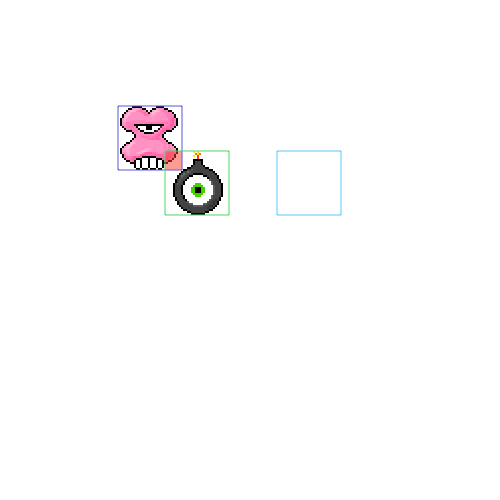
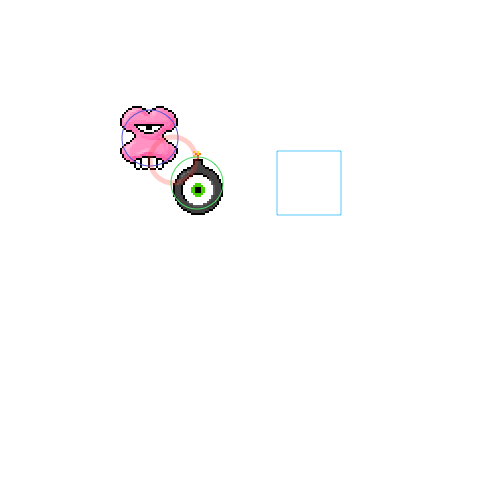

# Next Steps

Now that the game is mostly working it's time to consider what happens next. As it is this game is the prototype for a game. It shows a working concept but it is not a complete game. A complete game has objectives, a story and concept, goals, and rewards. Besides these, many improvements can be made to the existing elements. 

Take a few minutes and think about a concept and storyline that would add interest to the existing game concept. I need you to bring your ideas to this project. In a job situation, your team will want you to share your ideas. 

## Challenges 

This game was roughly based on the game Smove by Simple Machine. They seem to be out of business but the game is still on the App Store: https://apps.apple.com/in/app/smove/id968818637. You can read a review of the game here: https://www.tapsmart.com/games/review-smove/. Here is a video showing gameplay: https://www.pinterest.co.uk/pin/346143921336777890/ Smove. 

In this game, the player avoids all obstacles and tries to pick up "prizes" that appear periodically in one of the 9 intersections.

You can implement your ideas or try and implement these ideas in your version of the game.

**Challenge 0**

Make the game your own. I need to see your ideas! Think about what you can do to make the game more unique and interesting. This can be done in a few areas. 

- Change the art. Look for some new art changing the characters can change the whole feel and dynamic. Do you think our audience would respond more to an anime theme? Pokemon? or something more abstract? 
- Change the size of the screen. Currently, the screen is 500 by 500. This is was an arbitrary decision. Mobile games are popular. How would the gameplay at 375 x 667 (iPhone8 dimensions)

Here are some resources you can explore to find more art.

- Images
	- https://github.com/soggybag/Sprite-Atlas
	- https://opengameart.org
	- https://itch.io/game-assets/free
	- https://craftpix.net/freebies/
- Audio
	- https://mixkit.co/free-sound-effects/game/
	- https://freesound.org
	- [https://artlist.io/sfx/](https://artlist.io/sfx/?utm_source=google&utm_medium=cpc&utm_campaign=13681196073&utm_content=130971734784&utm_term=royalty%20free%20game%20sounds&keyword=royalty%20free%20game%20sounds&ad=530253732404&matchtype=p&device=c&gclid=Cj0KCQiAsqOMBhDFARIsAFBTN3fcskuJ5VhnLC6ioG15zYNgkc15Iw0xZhRmLy1ysSF39yuyEJh5TpwaAuBoEALw_wcB)

**Challenge 1** 

Set the background. Pygame doesn't seem to have a tiling image fill. You can use an image that fills the screen or use a background color to fill the background. 

**Challenge 2**

The background is very static and has no life. We need some elements in the background that can add some life and build the environment. You can take this where your concept might want to go. 

I'm going to present the idea of having some clouds floating in the background. Clouds are Sprites and can be animated in the `all_sprites` group. 

Create a new `Cloud` class. This class can extend `GameObject` or `Sprite`. It should display a cloud image (there are three cloud images in the images folder). Clouds should move slowly from left to right. When they get off the right side of the screen they should choose a random image and set their y position to random value and x to -64. From here they continue moving across the screen. 

Things floating by in the background could be anything. Fish, birds, or abstract shapes. It's up to you. Think about the environment you are trying to create. 

**Challenge 3** 

The game is growing in size. The codebase has grown in size. Moving forward it would be good to start dividing the code into modules. A module is a file containing python code. You can import variables, and classes from one module into another. 

Create `constants.py` and put your constants and other values there. 

```python
# constants.py
lanes = [93, 218, 343]
...
```

Create `GameObject.py` and move the GameObject class into this file. 

```python
# gameobject.py
import pygame
class GameObject(class GameObject(pygame.sprite.Sprite):
 ...

# main.py
import pygame
from GameObject import GameObject
...
```

Use this idea to break your code into a file. Create a `main.py` file that is your main game. It should initialize the pygame, create the main window, and define the game loop. It should also import and create the game objects. 

For each of the classes that make up your game create a separate file. 

- GameObject
- Apple
- Strawberry
- Bomb
- Player
- Cloud

Create another file for constants. These are variables and values shared by the other modules. Put values in here like `lanes` and `SCREEN_WIDTH` and `SCREEN_HEIGHT`. 

### Stretch Goals

**Challenge**

Add some sound. Games need sound. Pygame supports sound. Add some background sound: https://www.pygame.org/docs/ref/music.html. 

Sound will fall into two categories: ambient and incidental. Ambient sound is playing in the background constantly. Think of this as sounds from the environment, this includes music. These are usually longer sounds that continue for a while. Incidental sounds are usually short sounds that occur along with a game event. For example, picking up a fruit or a bomb hits a fruit. 

Pygame's mixer module handles playing sounds. Read about it here: 

- https://pythonprogramming.net/adding-sounds-music-pygame/
- https://www.pygame.org/docs/ref/mixer.html

You'll need some sounds to play. Explore these sites for audio: 

- https://freesound.org/browse/tags/game-sound/
- https://www.zapsplat.com/sound-effect-category/game-sounds/
- https://mixkit.co/free-sound-effects/game/
- https://opengameart.org/content/library-of-game-sounds

Consider adding sound for the following: 

- Play a short sound when the player picks up a fruit
- Play a short sound when the bomb destroys a fruit
- Play a longer sound, music or ambient, in the background while the game plays
- Play a short sound when the bomb hits the player. To do this one you need to delay ending the game until after the sound has finished playing. 

**Challenge**

Currently, there is no scorekeeping. Keep track of a score and display it using: https://www.pygame.org/docs/ref/font.html

Display some text near the top or bottom of the screen. When a player collects a fruit add about 40 million points to the score. 

With the score in place, it opens your gameplay up to possibilities. For example, getting hit by a bomb may not end the game instead you might just lose about a billion points. Apples might be worth 50 thousand points, strawberries could be worth 75 thousand. Maybe lemons are negative 100 thousand? 

**Challenge**

As it is the game quits when the player is hit by a bomb. Reset the game instead. All objects should return their starting positions and the score should be reset to 0. Consider player a sound when the game ends. 

**Challenge**

Our sprites are very static. By cycling through a series of images you can create an animated sprite. Take a look at the images in the folder here:

- [bomb](../solutions/example-7/images/bomb)
- [pink](../solutions/example-7/images/pink)
- [alien](../solutions/example-7/images/alien)


Your goal is to create a new class that can display a series of images in sequence. Take a clue from these: 

- Animated Sprites or Spriteheet
	- https://inventwithpython.com/pyganim/
	- https://stackoverflow.com/questions/14044147/animated-sprite-from-few-images
	- https://www.simplifiedpython.net/pygame-sprite-animation-tutorial/
	- https://www.techwithtim.net/tutorials/game-development-with-python/pygame-tutorial/pygame-animation/

Note! The term sprite sheet refers to a single image containing all of the "frames" of animation usually arranged in a grid. I have sprite sheets for the are used here ask me and I'll provide them. Also, you can find sprite sheets searching the web. It's a common technology used for games. 

I tried the pyganim class and had trouble getting it to work. I found it easier to make my own. Here is an outline of what you need to do. 

- Create a class that extends `pygame.sprite.Sprite`
- The class should take a list of files that will be the frames of the animation. 
- When initializing the class should load each of the images files and store the surface in a list. 
- The class has an attribute that defines the index of the current surface. 
- This class will implement a `render()` method like the `GameObject` but the render method will do this: 
 - increment the frame index
 - check if the frame index is passed the last frame. If so reset to frame 0
 - display the surface at the current frame index on the screen. 

Here is a code outline:

```Python
class AnimatedObject(pygame.sprite.Sprite):
	def __init__(self, x, y, files):
		super(AnimatedObject, self).__init__()
		self.x = x
		self.y = y
		self.images = []
		self.index = 0
		# create a surface from each file in files and add a 
		# surface to the images list

	def render(self, screen):
		# increment index 
		# if index is equal to the length of images 
		# set index to 0
		# blit the surface in images at the index to the screen
 
```

**Challenge**

The game currently allows the player to pick up fruit as long as they dodge the bomb. This is pretty easy. To make the game a little more challenging remove fruit that has been hit by the bomb. 

To do this you will need to check for collisions between the bomb and fruit. You can use the group to help with this. Group class has a method that checks for collisions between a sprite and all the members of the group. 

If you have the score working a player could lose points when the bomb collides with a fruit. 

**Challenge**

Improve the collisions. You may have noticed that the objects register a collision when they are near but not touching sometimes. This is because Pygame is looking at the rectangles for each sprite. 

See the image. Notice the rectangles over lap but the artwork is not overlapping. 



Pygame offers another type of collision detection using circles. Try switching your code to that method. 

In this image a circle centered on the art gives a more accurate collision. 



See the pygame docs and read about `sprite.collide_circle`. 

https://www.pygame.org/docs/ref/sprite.html#pygame.sprite.collide_circle

**Challenge**

Create different app "screens". As it is the game has a single screen. When start we see all of the game objects and we are playing the game. 

The goal of this challenge is to display a start message when the game begins and wait here for some user input like a keystroke or mouse click. This input will trigger the game to play. 

To make this work you'll have to work with your game loop. Currently, the game loop looks like this: 

```Python
# Create the game loop
running = True
while running:
	# Looks at events
	for event in pygame.event.get():
		# code here handles events

		# More code here handles 
		# rendering objects 
		# and collisions

```

You need to add a variable that can identify to your program what state the game is in. You might have several states: 

- ready
- playing

In this case, the game should start in the ready state then move to the playing state, When the player loses the game returns to the ready state:

```
ready -> playing -> ready -> playing ...
```

In code you might implement this like this:

```Python
# Create the game loop
game_state = 'ready'
running = True
while running:
	if game_state == 'ready':
		# display the game in a ready state
		# listen for events an event here should 
		# change game_state to 'playing'
		# set score to 0
		# reset or initialize the game objects

	elif game_state == 'playing':
		# listen for events
		# move game objects
		# check for collisions

	# Update the window
	pygame.display.flip()

	# tick the clock!
	clock.tick(30)
```

Your game might have a more complicated "flow". Imagine that there is a state for ready, playing, and game over. The logic might flow like this: 

```
ready -> playing -> game_over -> ready -> playing -> game_over
```

The game loop for this flow might look like this: 

```Python
# Create the game loop
game_state = 'ready'
running = True
while running:
	if game_state == 'ready':
		# display the game in a ready state
		# listen for events an event here should 
			# change game_state to 'playing'
			# set score to 0
			# reset or initialize the game objects
		# Draw the game ready state

	elif game_state == 'playing':
	# listen for events
	# move game objects
	# check for collisions

	elif game_state == 'game_over':
	# listening for events
		# handles events by setting game_state to 'ready'
	# draws the game over state

	# Update the window
	pygame.display.flip()

	# tick the clock!
	clock.tick(30)
```

**Challenge**

Make up your own challenge! The goal is to make a fun and interesting game! 

**Challenge**

Add some points that appear when a fruit is captured. The number of points should appear at the location of the captured sprite then disappear after a second or two. 

Bonus points for making the number move up the screen and fade away. 

Here's a formula. 

- Make a PointSprite - this should subclass GameObject
- It should override `self.surf` with the text you want to display.
- Give your new class a variable to count the number of frames it has been on the screen
- Increment the count each frame in the move or render method
- When the timer gets to 30 or 60 remove the sprite.

Initialize the Font module with:

```Python
pygame.font.init() # you have to call this at the start, 
                   # if you want to use this module.
myfont = pygame.font.SysFont('Comic Sans MS', 30)
```

Make a text surface with: 

```Python
textsurface = myfont.render('Some Text', False, (0, 0, 0))
```

When a collision occurs create a new PointSprite. Set it's x and y to the x and y of the collided sprite. Do this before removing that sprite. Add it to the all sprites group. 

