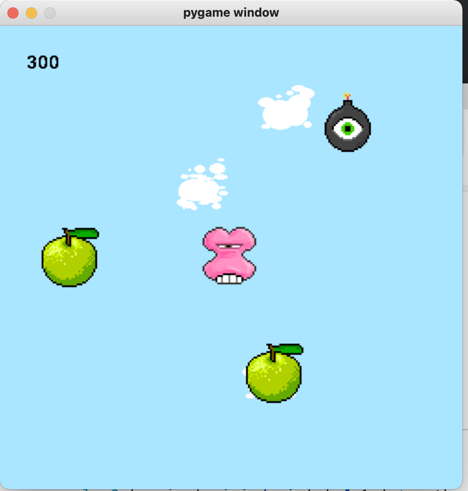
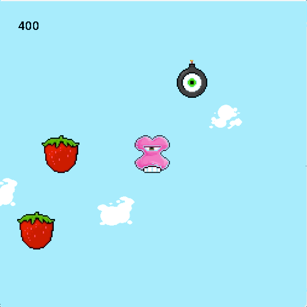

# Adding a Score

This was one of the challenges you may have solved on your own. If not you can follow the example here. If you have solved this challenge you can compare your solution to the one here. 

## Pygame Font

The `pygame.font` module allows you to draw text on the screen. 

initialize the module. You can place this anywhere. In your `main.py` after `pygame.init()` seems like the best place. 

```python
pygame.font.init()
```

The goal here is to display a score value near the top of the screen. A class will be a good way to handle this. 

Make a new `ScoreBoard.py` file. 

Here is an outline for the class: 

```python
import pygame

class ScoreBoard(pygame.sprite.Sprite):
	def __init__(self, x, y, score):
		super(ScoreBoard, self).__init__()

	def update(self, points):
		pass

	def move(self):
		pass

	def render(self, screen):
		pass

	def reset(self):
		pass

```

Notice we are extending sprite. 

This class also has a `render()` method so it is polymorphic with our other "renderables".

The class initializes with an x and y and a score. 

The `update()` method takes some `points` as a parameter. We'll use this method to update the score. 

The class has a move `method()` even though it might not move. Since we call `move()` and `render()` on all sprites. Giving this class a move method will mean we can put it in the `all_sprites` group without special consideration. 

## Initializing the ScoreBoard

Look at the `__init__()` function. 

```Python
def __init__(self, x, y, score):
	super(ScoreBoard, self).__init__()
		self.score = score
		self.font = pygame.font.SysFont('Comic Sans MS', 30)
		self.surf = self.font.render(f"{self.score}", False, (0, 0, 0))
		self.dx = 0
		self.dy = 0
		self.x = x
		self.y = y
```

Here we define all of the properties our other sprites have: `x`, `y`, `dx`, `dy`, and `surf`. 

We also added some new properties:

- `self.score` - keeps track of score value Int
- `self.font` - This is a pygame font object that will allow us to create a surface to display text. This needs to be configured. Here configured the font family to comic sans and the size to 30 pixels. 
- `self.surf` - Holds a surface we generate by calling `self.font.render()`. The last argument here is a tuple for the color (black in this case)

Add the move method: 

```python
def move(self):
	self.x += self.dx
	self.y += self.dy
```

The `move()` is the same as the same as what the `GameObject`. 

Note that the `ScoreBoard` is probably not going to move. But this will make it possible to move it if needed and will make it compatible with all of the other sprites in the `all_sprites` list. 

Add the update method: 

```python
def update(self, points):
	self.score += points
```

This method takes in points and int which is added to `self.score`. 

You can call this on an instance of `ScoreBoard` when you want to update the score. 

Now add the render method. 

```python
def render(self, screen):
	self.surf = self.font.render(f"{self.show_score}", False, (0, 0, 0))
	screen.blit(self.surf, (self.x, self.y))
```

Here we need to create a surface to render the text. To do that we call `self.font.render()` and pass the new text along with some other arguments. The last argument is the color as a tuple. 


The last method is `reset()`. This method resets the score to 0. 

```python
def reset(self):
	self.score = 0
```

## Create an instance of ScoreBoard

Import `ScoreBoard` into your `main.py` file. 

```python
from ScoreBoard import ScoreBoard
```

Then make a new instance:

```python
score = ScoreBoard(30, 30, 0)
```

This makes a new instance 30 pixels from the left and 30 pixels from the top. 

The starting score is 0. 

Adjust these values to suit your game. 

Last, add the new `score` instance to the `all_sprites` group. 

```python
all_sprites.add(score)
```

This should have the effect of rendering your scoreboard to the screen. 

It might look like this: 



## Adding points

Now that the score is displaying you need to update the value when the player captures a fruit. 

Find the code that identifies a collision between fruit and player. 

Your code may differ from mine but it should look similar. This is what I have: 

```python
# Check collisions
fruit = pygame.sprite.spritecollideany(player, fruit_sprites)
if fruit:
	score.update(100) # update score
	fruit.reset()
```

Here I find a collision and update the score with 100 points. 

## Challenges

Try these challenges with the code above. 

**Challenge**

Change the font family. You'll only be able to use a font that is available on your computer and you'll have to supply the exact name of that font. 

Check the fonts available on your system. 

**Challenge** 

Change the size, color, and position of the score. 

**Challenge**

Score a different number of points for different fruit types:

- Apples = 100
- Strawberry = 500
- Lemon = -300

**Challenge**

The score looks good but it might be fun if the score counted the points. Instead of just showing the new score it should count up to the new value when points are updated. 

For example, imagine we just found a collision with an apple and updated the score with 100 points. The current score is 0. The score displayed on the screen should start counting: 

- 0
- 1
- 2
- 3
- ...
- 99
- 100

If you count every frame it should count pretty quickly. If the count seems too slow count in fast increments like 5s or 10s. 

**Super Stretch Challenge**

Add a new PointSprite class. This class will display some points at the point where you scored them and move up and fade out. 

For example: 



The compression on this gif doesn't show the numbers on the first collision with the Strawberry but you can see 100 appear when we hit the apple. 

The idea is to make a script that shows the number of points added. The sprite appears at the location of the collision. The sprite moves up the screen and fades out after it appears. 